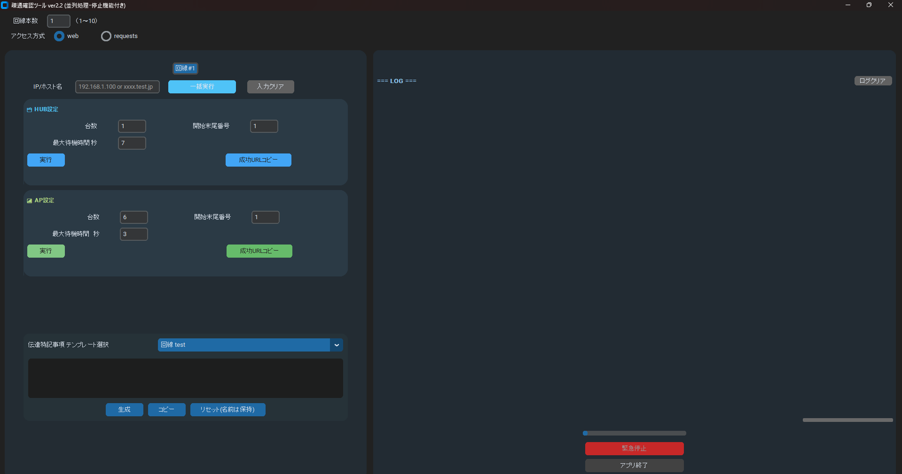

# 疎通確認ツール ver2.2

[▶️ 最新リリース（v2.2）を確認する](https://github.com/Miyavi-kannzaki/PingAccessAutomationTool/releases/tag/v2.2)

## 🛠 概要

CustomTkinter 製の GUI ツールで、ネットワーク機器（RT/HUB/AP）への IP 疎通確認を並列実行。  
非エンジニア向けに直感的な UI で設計し、現場検証・社内報告業務を効率化。  
**現場の報告業務・機器確認の属人化を防ぎ、非エンジニアでも安心して使える業務支援ツールとして自主開発。**

## 🔍 主な機能

- RT/HUB/AP への URL 疎通確認（ポート指定）
- 成功 URL の個別コピー
- テンプレート文の自動生成（作業報告用）
- 緊急停止ボタン
- ログ出力／色分け／件数集計

## 💻 技術構成

- Python 3.10+
- CustomTkinter
- requests / pyperclip / concurrent.futures
- マルチスレッドによる並列処理

## 📸 スクリーンショット



※必要に応じて他の画面も追加可能です（例：文章生成 UI やログ表示画面）

## 🔧 起動方法

```bash
pip install -r requirements.txt
python PingAccessAutomationTool_v2.2.py
```
